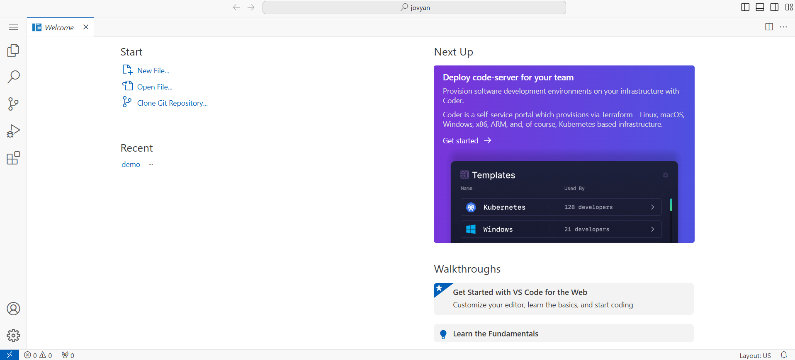

# 🧑‍💻 Step 0 — Set up your Vayu AI Studio Workspace

**Move-It** › **Vayu AI Studio Workspace** · `00_vayu_workspaces/`

<table width="100%" style="width:100%">
<tr>
<td align="left"><a href="../README.md">Previous — Move-It overview</a></td>
<td align="right"><a href="../01_dataset/">Next — Step 1 — Vayu Object Storage</a></td>
</tr>
</table>

Welcome to **Move-It**! This step helps you set up the Vayu AI Studio Workspace required for your IoT data pipeline and machine learning training.

---

<details>
<summary><h3>🗺️ Workspace overview</h3></summary>



</details>

---

<details>
<summary><h3>🔗 Open workspace</h3></summary>

Go to [Vayu AI Studio Workspace](https://ipcloud.tatacommunications.com/aistudio/#/build/workspace-list).

For the full create wizard (Start → Infrastructure → Configure Compute and Storage → Observability → Review), see the [Creating Workspace guide](https://ipcloud.tatacommunications.com/docs/docs/user-docs/vayu-ai-studio/workspace/#creating-workspace).

</details>

---

<details>
<summary><h3>🚀 Getting started</h3></summary>

1. **Create a Vayu AI Studio Workspace**

   > **Skip this step** if a Vayu AI Studio workspace has already been provided to you — continue with step 2 below.
   - Log in to [Vayu AI Studio](https://ipcloud.tatacommunications.com/aistudio/#/build/workspace-list).
   - Click **Create Workspace** and follow the prompts. See the [Creating Workspace guide](https://ipcloud.tatacommunications.com/docs/docs/user-docs/vayu-ai-studio/workspace/#creating-workspace) for step-by-step wizard details.
   - **Object storage host alias:** During workspace creation, add a **host alias** for object storage using the **IP** and **endpoint** from the **Access Guide**. Enter the endpoint as the hostname **only** — do not include `http://` or `https://`.
   - Make sure **Enable Docker in the Workspace** is turned on before you finish creating the workspace.

2. **Import This Repository**

   Clone the `move-it` repository into your workspace home (`/home/jovyan`):

   ```bash
   cd /home/jovyan
   git clone https://ailab.cloudservices.tatacommunications.com/code/vayu-hackathon/move-it.git
   ```

   Or, upload it manually via the UI.

3. **Install Python Dependencies**

   Inside your workspace terminal:

   ```bash
   cd /home/jovyan
   python3 -m venv .venv
   source .venv/bin/activate
   cd move-it
   pip install -r requirements.txt
   ```

4. **Select the notebook kernel**

   When you open any `.ipynb` in this project, use the virtual environment above:
   1. Open **Select Kernel** and choose **Python Environments**.

      

   2. Under **Select a Python Environment**, pick the **Recommended** environment (it should point to the `.venv` you created).

      

   3. **Validate the path:** Confirm the selected interpreter path ends with `<your-env-name>/bin/python` (for example, `.venv/bin/python` if you created `.venv` in step 3).

</details>

---

#### Resources

- [Vayu AI Studio Workspace Dashboard](https://ipcloud.tatacommunications.com/aistudio/#/build/workspace-list)
- [Workspace documentation](https://ipcloud.tatacommunications.com/docs/docs/user-docs/vayu-ai-studio/workspace/)

<table width="100%" style="width:100%">
<tr>
<td align="left"><a href="../README.md">Previous — Move-It overview</a></td>
<td align="center"><a href="/README.md">Overview</a></td>
<td align="right"><a href="/01_dataset/">Next — Step 1 — Vayu Object Storage</a></td>
</tr>
</table>
