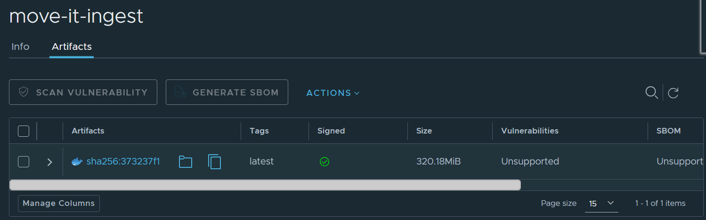
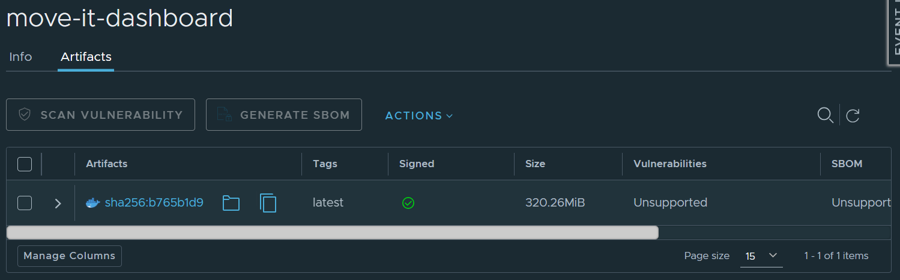

# ☁️ Step 8 — Deploy Move-It (Two ML Services)

**Move-It** › **Vayu ML Service** · `08_deploy/`

| [← Previous — Step 7 — Build App](../07_build_app/) | Journey complete |
|:---|---:|

Deploy the **Move-It dashboard** (Streamlit + co-located ingest API) to the **Vayu platform** as an **ML Service**. After deployment you get a **Public Endpoint** where judges can run the built-in simulator, see live telemetry, and watch irrigation predictions from your **Vayu Model Serving** endpoint.

1. **Ingest API** (`ingestion_api.py`) — HTTP → Kafka
2. **Dashboard** (`app.py`) — simulator, Kafka consumer, Model Serving client, Streamlit UI

Deploy **ingest first**, copy its **Public Endpoint**, then deploy the dashboard with `INGEST_API_URL` pointing at it.

---

<details>
<summary><h3>🗺️ Architecture</h3></summary>

```text
ML Service 2 — Dashboard (:8501)     app.py · simulator
        │
        │  POST /ingest
        ▼
ML Service 1 — Ingest (:5000)        ingestion_api.py
        │
        ▼
Vayu Kafka — greenhouse_telemetry (Step 3)
        │
        │  Kafka consumer (app.py)
        ▼
ML Service 2 — Dashboard (:8501)
        │
        │  POST predict
        ▼
Vayu Model Serving (Step 6)
```

| Service | Image | Port | Framework |
|---------|-------|------|-----------|
| **move-it-ingest** | `Dockerfile.ingest` | **5000** | **Python3** (CMD runs uvicorn) |
| **move-it-dashboard** | `Dockerfile.dashboard` | **8501** | **Streamlit** |

</details>

---

<details>
<summary><h3>📋 Prerequisites</h3></summary>

| Step | Folder | You need |
|------|--------|----------|
| 3 | [`03_vayu_kafka/`](../03_vayu_kafka/) | Kafka **Ready**, topic created |
| 6 | [`06_deploy_model/`](../06_deploy_model/) | Model Serving **Ready** — predict URL |
| 7 | [`07_build_app/`](../07_build_app/) | Tested locally |
| — | Container registry | Registry username and CLI secret (provided in the **Access Guide**; see also the [Container Registry guide](https://ipcloud.tatacommunications.com/docs/docs/user-docs/vayu-ai-studio/registry/)) |

**Before Step 8:** Run locally with two terminals ([Step 7](../07_build_app/README.md)) and confirm **Start Simulation** works.

</details>

---

<details>
<summary><h3>📂 Folder contents</h3></summary>

| File / folder | Purpose |
|---------------|---------|
| [`image-signing/`](image-signing/) | Optional automated signing guide and [`sign_image.py`](image-signing/sign_image.py) |

</details>

---

<details>
<summary><h3>📦 Step 1 — Build and push both images</h3></summary>

Build context **must** be `move-it/` (not `07_build_app/`). You build **two images** — one per ML Service:

| Image tag | Dockerfile | Port | Purpose |
|-----------|------------|------|---------|
| `<image-registry>/<project>/move-it-ingest:latest` | `Dockerfile.ingest` | **5000** | **Ingest API** — FastAPI (`ingestion_api.py`) publishes sensor readings to **Vayu Kafka**. Deploy **first**. |
| `<image-registry>/<project>/move-it-dashboard:latest` | `Dockerfile.dashboard` | **8501** | **Dashboard** — Streamlit (`app.py`) with simulator, Kafka consumer, and Model Serving client. Deploy **second**. |

For registry login and push details, see the [Container Registry guide](https://ipcloud.tatacommunications.com/docs/docs/user-docs/vayu-ai-studio/registry/). Set `IMAGE_REGISTRY`, `REGISTRY_PROJECT`, `REGISTRY_USERNAME`, and `REGISTRY_PASSWORD` in the root [`.env`](../README.md) using values from the **Access Guide**. Image tags use the form `$IMAGE_REGISTRY/$REGISTRY_PROJECT/<image-name>:latest`.

```bash
cd /home/jovyan/move-it
set -a && source .env && set +a && echo "$REGISTRY_PASSWORD" | docker login "$IMAGE_REGISTRY" -u "$REGISTRY_USERNAME" --password-stdin

docker build -f 07_build_app/Dockerfile.ingest -t $IMAGE_REGISTRY/$REGISTRY_PROJECT/move-it-ingest:latest --push .
docker build -f 07_build_app/Dockerfile.dashboard -t $IMAGE_REGISTRY/$REGISTRY_PROJECT/move-it-dashboard:latest --push .
```

Re-run `set -a && source .env && set +a` (and the `docker login` line that follows) whenever you update registry variables in `.env` — otherwise the shell still has the old values.

*If you push a new tag, the **previous tag must be signed before** you push the new one. See **Step 2** below for signing instructions.*

</details>

---

<details>
<summary><h3>✍️ Step 2 — Sign both images</h3></summary>

Vayu ML Services require **signed** container images. Sign **each** image after push — repeat for ingest and dashboard.

Follow the [Container Registry guide](https://ipcloud.tatacommunications.com/docs/docs/user-docs/vayu-ai-studio/registry/) (Steps 4–8: certificates, `tcl-cosign`, sign, and verify). Image references:

- `<image-registry>/<project>/move-it-ingest:latest`
- `<image-registry>/<project>/move-it-dashboard:latest`

**Optional:** use the [automated image signing guide](image-signing/README.md).

**Verify signatures in the Container Registry**

1. Open [Vayu Container Registry](https://ipcloud.tatacommunications.com/cloud/console/vks/#/ms/vayucontainerregistry) and log in using your **Vayu credentials**.
2. Under **Project Name**, select the appropriate project (named in the **Access Guide**).
3. On the project overview page, click **View Dashboard**.
4. Open the **`move-it-ingest`** and **`move-it-dashboard`** repositories.
5. Confirm both `move-it-ingest:latest` and `move-it-dashboard:latest` show ✅ under **Signed**. If you see ❌, the image is not signed — repeat **Step 2 — Sign both images** before deploying.

**Ingest image (`move-it-ingest:latest`):**



**Dashboard image (`move-it-dashboard:latest`):**



</details>

---

<details>
<summary><h3>🔗 Step 3 — Open Vayu ML Services</h3></summary>

Go to [Vayu ML Services](https://ipcloud.tatacommunications.com/aistudio/#/deploy/mlops-service-list).

For the full create wizard (Start → Infrastructure → Configure Compute → Observability → Review), see the [Creating ML Service guide](https://ipcloud.tatacommunications.com/docs/docs/user-docs/vayu-ai-studio/ml-service/#creating-ml-service).

</details>

---

<details>
<summary><h3>🅰️ Phase A — Deploy ingest API (first)</h3></summary>

#### A.1 Start — image and runtime

| Field | Value |
|-------|-------|
| **Name** | e.g. `move-it-ingest` |
| **Framework** | **Python3** |
| **Image** | `<image-registry>/<project>/move-it-ingest:latest` |
| **Port** | **5000** |

#### A.2 Public Expose

Enable **Public Expose** in the ML Service wizard.

#### A.3 Environment variables

| Key | Required |
|-----|----------|
| `KAFKA_BROKER` | Yes |
| `KAFKA_USERNAME` | Yes |
| `KAFKA_PASSWORD` | Yes |
| `KAFKA_TOPIC` | No (default `greenhouse_telemetry`) |

#### A.4 Verify ingest

When status is **Ready**, on the ML Service detail page, **copy the Public Endpoint** (call it `<INGEST_ENDPOINT>`).

```bash
curl -s "<INGEST_ENDPOINT>/health"
curl -s -X POST "<INGEST_ENDPOINT>/ingest" \
  -H "Content-Type: application/json" \
  -d '{"temp": 25.0, "humidity": 60.0, "MOI": 10.0}'
```

Both should return JSON with `"status": "ok"`. Swagger UI: `<INGEST_ENDPOINT>/docs`.

Set **`INGEST_API_URL=<INGEST_ENDPOINT>/ingest`** for Phase B (include the `/ingest` path).

#### A.5 Firewall rules

After the ingest ML Service is **Ready**, configure firewall rules so external clients can reach `<INGEST_ENDPOINT>`. Follow the **Firewall rules SOP** shared with your team.

</details>

---

<details>
<summary><h3>🅱️ Phase B — Deploy dashboard (second)</h3></summary>

#### B.1 Start — image and runtime

| Field | Value |
|-------|-------|
| **Name** | e.g. `move-it-dashboard` |
| **Framework** | **Streamlit** |
| **Image** | `<image-registry>/<project>/move-it-dashboard:latest` |
| **Port** | **8501** |

#### B.2 Public Expose

Enable **Public Expose** in the ML Service wizard.

#### B.3 Environment variables

| Key | Required | Description |
|-----|----------|-------------|
| `INGEST_API_URL` | **Yes** | Phase A **Public Endpoint**, e.g. `https://<INGEST_ENDPOINT>/ingest` |
| `PREDICT_URL` | **Yes** | From [Step 6](../06_deploy_model/) |
| `KAFKA_BROKER` | Yes | Same broker as ingest |
| `KAFKA_USERNAME` | Yes | |
| `KAFKA_PASSWORD` | Yes | |
| `KAFKA_TOPIC` | No | Default `greenhouse_telemetry` |

**Example:**

```text
INGEST_API_URL=https://<INGEST_ENDPOINT>/ingest
PREDICT_URL=https://<MODEL_SERVING_ENDPOINT>/v1/models/<MODEL_ID>:predict
KAFKA_BROKER=<VAYU_KAFKA_BROKER>
KAFKA_USERNAME=<VAYU_KAFKA_USERNAME>
KAFKA_PASSWORD=<VAYU_KAFKA_PASSWORD>
KAFKA_TOPIC=greenhouse_telemetry
```

#### B.4 Infrastructure

| Field | Guidance |
|-------|----------|
| **Resources** | CPU is sufficient |
| **Replicas** | `1` for demo |

#### B.5 Note the dashboard endpoint

When status is **Ready**, on the ML Service detail page, **copy the Public Endpoint** for the dashboard.

#### B.6 Firewall rules

After the dashboard ML Service is **Ready**, configure firewall rules so external clients can reach the dashboard **Public Endpoint**. Follow the **Firewall rules SOP** shared with your team.

</details>

---

<details>
<summary><h3>🔍 Step 4 — Verify end-to-end</h3></summary>

1. Open the dashboard **Public Endpoint**.
2. Sidebar should show your ingest **Public Endpoint** (not `127.0.0.1`).
3. Confirm **Kafka: Connected**.
4. Click **Start Simulation**.
5. Verify temperature/humidity update and **Irrigation Action** from Model Serving.

| Symptom | What to check |
|---------|---------------|
| Ingest `/health` fails | Port **5000**, **Public Expose**, pod **Ready** |
| Dashboard page won't load | Port **8501**, **Public Expose**, firewall rules — follow the **Firewall rules SOP** |
| Simulation error / JSON parse | `INGEST_API_URL` must be the ingest **Public Endpoint** from Phase A (`<INGEST_ENDPOINT>/ingest`) |
| Sidebar still shows `127.0.0.1` | `INGEST_API_URL` not set on dashboard ML Service |
| Kafka disconnected | Same `KAFKA_*` on both services; topic exists |
| No predictions | `PREDICT_URL`; Model Serving **Ready** |

</details>

---

<details>
<summary><h3>✔️ Demo checklist</h3></summary>

- [ ] **Ingest** ML Service **Ready** on port **5000**; `/health` and `/ingest` work publicly
- [ ] **Dashboard** ML Service **Ready** on port **8501** with `INGEST_API_URL` + `PREDICT_URL`
- [ ] **Start Simulation** updates telemetry and irrigation predictions
- [ ] Both images pushed and **signed** from `move-it/` root
- [ ] **Public Endpoints** documented for judges

</details>

---

<details>
<summary><h3>💡 Pro tips</h3></summary>

- Use the **built-in simulator** for a reliable hackathon demo; real sensors need the ingest API reachable on port 5000 inside the pod (already started by the container `CMD`).
- If predictions are slow, check **Vayu Model Serving** latency separately from the dashboard.
- Never commit secrets — set `PREDICT_URL` and Kafka credentials in the ML Service UI only.

</details>

---

#### Resources

- [Creating ML Service guide](https://ipcloud.tatacommunications.com/docs/docs/user-docs/vayu-ai-studio/ml-service/#creating-ml-service)
- [Container Registry guide](https://ipcloud.tatacommunications.com/docs/docs/user-docs/vayu-ai-studio/registry/)
- **Firewall rules SOP** — follow the SOP shared with your team

---

| [← Previous — Step 7 — Build App](../07_build_app/) | [Overview](../README.md) | Journey complete |
|:---|:---:|---:|
