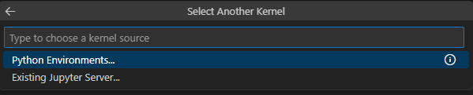
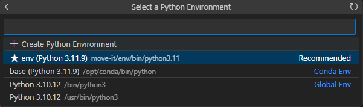

# Move-It — Starter Template

## Problem statement and outcome

**Problem:** Traditional greenhouse irrigation often relies on manual scheduling or simple timers, leading to water waste or plant stress due to unpredictable environmental changes. Choose a real usecase (e.g., a smart greenhouse, an automated hydroponics farm, or a vertical urban farm) and a sensor set they care about. Build an end‑to‑end IoT-to-ML pipeline **using the Vayu platform**: simulate sensors (Wokwi ESP32) streaming data via HTTP to a **Flask API**, ingest data into a **Vayu Kafka** topic, process the stream in a **Vayu AI Studio** notebook to train a model, and deploy a **Streamlit** dashboard that provides real-time monitoring and automated irrigation decisions.

**Outcome:** This starter template demonstrates a complete streaming ML pipeline: sensor data $\to$ HTTP $\to$ Kafka $\to$ Streamlit $\to$ ML Inference. The UI returns real-time telemetry (Temperature, Humidity), predicts water requirements using a trained model (e.g., Random Forest), and visualizes the irrigation action (ON/OFF) in a live dashboard.

---

## Project layout (steps)

```
move-it/
├── README.md
├── requirements.txt
│
├── 00_vayu_workspaces/       # Vayu AI Studio workspace allocation
├── 01_dataset/               # Historical sensor logs for training
├── 02_vayu_mlflow/           # MLflow experiment tracking
├── 03_vayu_kafka/            # Kafka deployment & create_topic.py
├── 04_starter-kit/           # train_model.ipynb — training template
├── 05_model_registry/        # upload_model.py & model registration
├── 06_deploy_model/          # Model deployment to Vayu Model Serving
└── 07_build_app/             # FastAPI ingest + Streamlit dashboard + simulator
```

| Step | Vayu service | Folder | What to run / open |
|------|--------------|--------|-------------------|
| 0 | **Vayu AI Studio Workspace** | `00_vayu_workspaces/` | `README.md` — create workspace (enable Docker) |
| 1 | **Vayu Object Storage** | `01_dataset/` | `01_dataset.ipynb` — pull/upload dataset from S3 |
| 2 | **Vayu MLflow** | `02_vayu_mlflow/` | `README.md` — deploy managed MLflow |
| 3 | **Vayu Kafka** | `03_vayu_kafka/` | `create_topic.py` — deploy Kafka and create topic |
| 4 | **Data Pipeline & ML Lab** | `04_starter-kit/` | `train_model.ipynb` — train and save `model.joblib` |
| 5 | **Vayu Model Registry** | `05_model_registry/` | `upload_model.py` — upload and register model |
| 6 | **Vayu Model Serving** | `06_deploy_model/` | `README.md` — deploy Predictive AI endpoint |
| 7 | **Vayu Realtime Inference** | `07_build_app/` | FastAPI ingest + Streamlit dashboard (built-in simulator) |

---

## Mapping to the Vayu “Move-It — Guided Journey”

| Journey step | How to leverage Vayu ecosystem (detailed) |
|--------------|------------------------------------------|
| **Vayu AI Studio Workspace** | Create your workspace with **Enable Docker in the Workspace** turned on, then clone this repo (`00_vayu_workspaces/`). |
| **Vayu Object Storage** | Pull `cropdata.csv` from S3 if needed, using upload/download snippets in `01_dataset/` (`01_dataset.ipynb`). |
| **Vayu MLflow** | Deploy managed MLflow, configure S3 and database, and wait for **Ready** (`02_vayu_mlflow/`). |
| **Vayu Kafka** | Deploy Kafka, run `create_topic.py`, and wait for **Ready** (`03_vayu_kafka/`). |
| **Starter Kit (Training)** | Train with `train_model.ipynb`, log to MLflow, and save `model.joblib` (`04_starter-kit/`). |
| **Vayu Model Registry** | Upload `model.joblib` to S3 and register with sklearn metadata (`05_model_registry/`). |
| **Vayu Model Serving** | Deploy via **Predictive AI**, selecting the registered model and version (`06_deploy_model/`). |
| **Vayu Realtime Inference** | Host the Streamlit dashboard to visualize live sensor trends and predictions (`07_build_app/`). |

---

## Tech direction / tools (Vayu ecosystem)

| Layer | Vayu / stack choice |
|--------|---------------------|
| Sensors | **Wokwi ESP32 + DHT22** (Simulated) |
| Ingestion | **Flask API** $\to$ **Vayu Kafka** |
| Stream Processing | **Jupyter Notebook** (Kafka Consumer) |
| ML Framework | **Scikit-learn (Random Forest)** + **Pandas** |
| Experiment Tracking | **Vayu MLflow** |
| Deployment | **Vayu Model Serving** (Model Endpoint) |
| Dashboard | **Streamlit** |

---

## Quick start

### What this code does

1. **Data Ingestion** — FastAPI gateway (`07_build_app/ingestion_api.py`) receives HTTP POST from the simulator and pushes to Kafka.
2. **ML Pipeline** — Jupyter notebook trains the model (`04_starter-kit/train_model.ipynb`).
3. **Dashboard** — Streamlit UI (`07_build_app/app.py`) consumes Kafka, runs ML inference, and shows live telemetry. Includes a **built-in simulator** (no separate ESP32 required for the demo).

### Minimal run

1. **Set up the environment**
   ```bash
   cd move-it
   pip install -r requirements.txt
   ```

2. **Create a `.env` file** in the project root (`move-it/.env`) with your Vayu credentials:

   ```bash
   # Vayu Object Storage (S3)
   AWS_ACCESS_KEY_ID=<your-access-key>
   AWS_SECRET_ACCESS_KEY=<your-secret-key>
   S3_ENDPOINT=<your-s3-endpoint>
   S3_BUCKET_NAME=<your-bucket-name>
   S3_DATASET_KEY=cropdata.csv
   S3_MODEL_KEY=move-it/model.joblib

   # Vayu MLflow
   MLFLOW_TRACKING_URL=https://<your-mlflow-host>
   MLFLOW_TRACKING_USERNAME=<your-username>
   MLFLOW_TRACKING_PASSWORD=<your-password>

   # Vayu Kafka
   KAFKA_BROKER=<your-kafka-broker-url>
   KAFKA_USER=<your-kafka-user>
   KAFKA_PASS=<your-kafka-password>
   KAFKA_TOPIC=greenhouse_telemetry
   ```

   Python scripts and notebooks load this file automatically via `load_dotenv`. Do not commit `.env` to git.

3. **Run training (once)**

   Open `04_starter-kit/train_model.ipynb` in Vayu AI Studio, select the kernel, then run all cells:

   1. Open **Select Kernel** and choose **Python Environments**.

      

   2. Under **Select a Python Environment**, pick the **Recommended** environment (it should point to the `.venv` from [Step 0](00_vayu_workspaces/)).

      

   See [Step 4](04_starter-kit/) for full training details.

4. **Launch the realtime pipeline** (`07_build_app/`)

   **Terminal 1 — ingestion API**
   ```bash
   cd 07_build_app
   python ingestion_api.py
   ```

   **Terminal 2 — dashboard + simulator**
   ```bash
   cd 07_build_app
   export INGEST_API_URL="http://127.0.0.1:5000/ingest"
   streamlit run app.py
   ```

   Click **Start Simulation** in the Streamlit sidebar.

   **Or build the Docker image** for [Step 8](../08_deploy/) — see [`07_build_app/README.md`](07_build_app/README.md).

---

## License

Use and modify for the **Vayu Hackathon** submission unless your team repo specifies otherwise.
